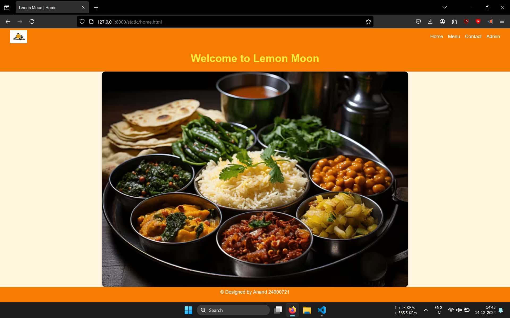
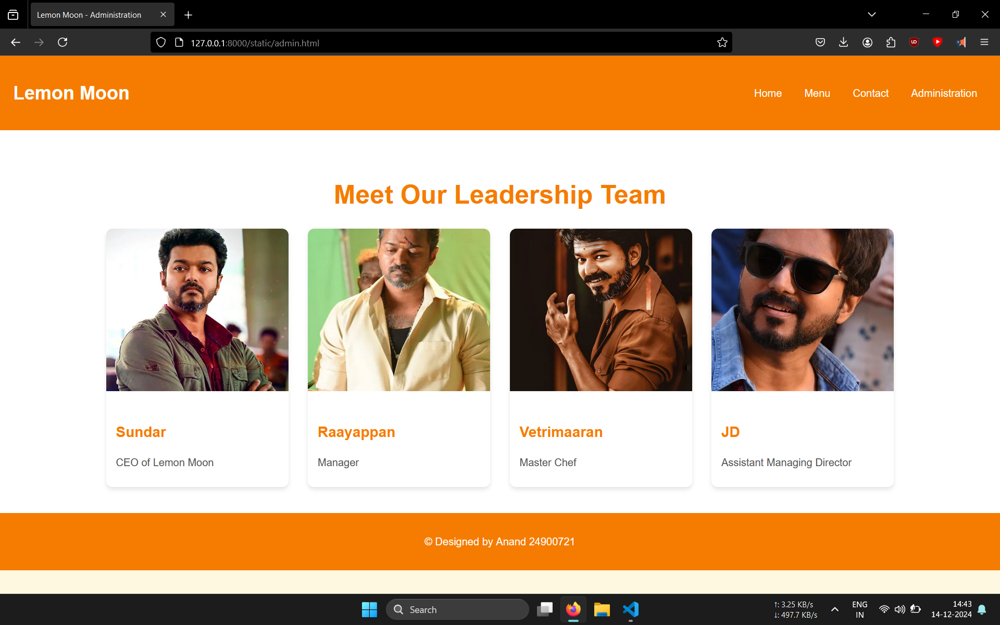
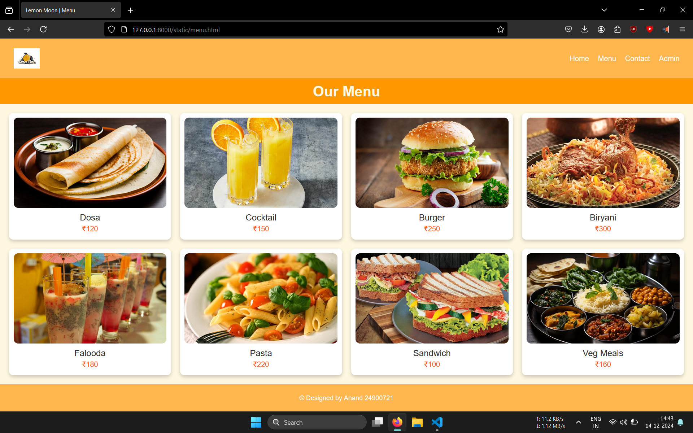
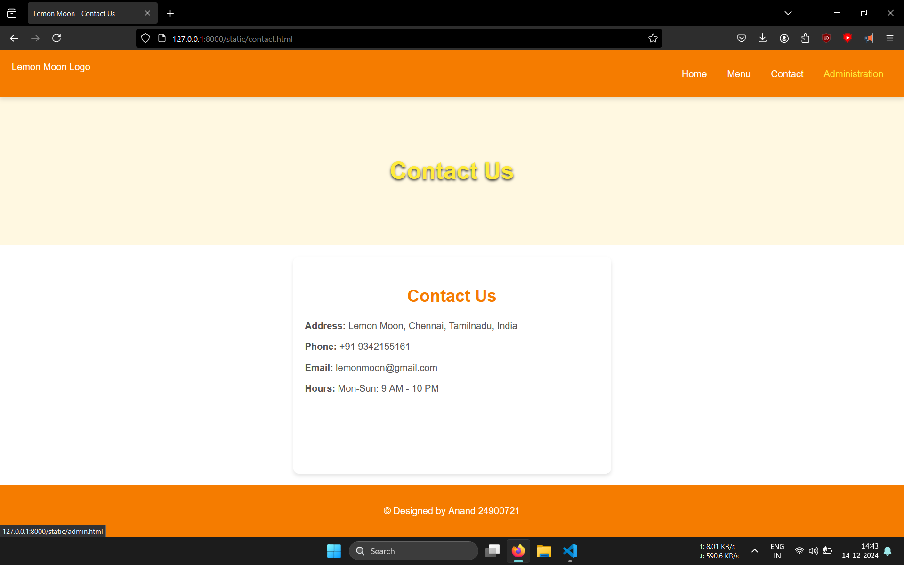

# Ex.07 Restaurant Website
## Date:14-12-2024

## AIM:
To develop a static Restaurant website to display the food items and services provided by them.

## DESIGN STEPS:

### Step 1:
Requirement collection.

### Step 2:
Creating the layout using HTML and CSS.

### Step 3:
Updating the sample content.

### Step 4:
Choose the appropriate style and color scheme.

### Step 5:
Validate the layout in various browsers.

### Step 6:
Validate the HTML code.

### Step 7:
Publish the website in the given URL.

## PROGRAM:
```
home.html

<!DOCTYPE html>
<html lang="en">

<head>
    <meta charset="UTF-8">
    <meta name="viewport" content="width=device-width, initial-scale=1.0">
    <title>Lemon Moon | Home</title>
    <link href="https://fonts.googleapis.com/css2?family=Helvetica:wght@400;500&display=swap" rel="stylesheet">
    <style>
        /* General Styling */
        body {
            margin: 0;
            font-family: 'Helvetica', sans-serif;
            line-height: 1.4;
            color: #4A4A4A;
            background-color: #FFF8E1;
            display: flex;
            flex-direction: column;
            justify-content: space-between;
            height: 100vh; /* Fit viewport height */
            overflow: hidden; /* No scrolling */
            box-sizing: border-box;
        }

        *, *::before, *::after {
            box-sizing: inherit;
        }

        /* Header Styling */
        header {
            background: #F57C00;
            color: white;
            padding: 5px 30px;
            display: flex;
            align-items: center;
            justify-content: space-between;
            height: 10%; /* Proportional height */
        }

        header img {
            height: 40px;
            width: auto;
        }

        header nav {
            display: flex;
            gap: 15px;
        }

        header nav a {
            text-decoration: none;
            color: white;
            font-weight: 500;
            font-size: 0.9rem;
        }

        /* Banner Section */
        .banner {
            display: flex;
            align-items: center;
            justify-content: center;
            background: #F57C00;
            color: white;
            height: 20%; /* Proportional height */
            text-align: center;
        }

        .banner h1 {
            font-family: 'Helvetica', sans-serif;
            font-size: 2rem;
            color: #FFEB3B;
            margin: 0;
        }

        /* Image Section */
        .highlight-image {
            flex: 1; /* Take remaining height */
            display: flex;
            justify-content: center;
            align-items: center;
        }

        .highlight-image img {
            max-width: 60%;
            max-height: 100%;
            object-fit: contain;
            border-radius: 10px;
            box-shadow: 0 4px 8px rgba(0, 0, 0, 0.2);
        }

        /* Footer Styling */
        footer {
            background: #F57C00;
            color: white;
            text-align: center;
            padding: 5px;
            height: 10%; /* Proportional height */
        }

        footer p {
            margin: 0;
            font-size: 0.9rem;
        }
    </style>
</head>

<body>
    <!-- Header Section -->
    <header>
        
        <nav>
            <a href="home.html">Home</a>
            <a href="menu.html">Menu</a>
            <a href="contact.html">Contact</a>
            <a href="admin.html">Admin</a>
        </nav>
    </header>

    <!-- Banner Section -->
    <div class="banner">
        <h1>Welcome to Lemon Moon</h1>
    </div>

    <!-- Highlight Image Section -->
    <div class="highlight-image">
        
    </div>

    <!-- Footer Section -->
    <footer>
        <p>&copy; Designed by Anand 24900721</p>
    </footer>

</body>

</html>

admin.html

<!DOCTYPE html>
<html lang="en">
<head>
    <meta charset="UTF-8">
    <meta name="viewport" content="width=device-width, initial-scale=1.0">
    <title>Lemon Moon - Administration</title>
    <link href="https://fonts.googleapis.com/css2?family=Helvetica:wght@400;500&display=swap" rel="stylesheet">
    <style>
        body {
            margin: 0;
            font-family: 'Helvetica', sans-serif;
            line-height: 1.6;
            color: #4A4A4A;
            background-color: #FFF8E1;
            box-sizing: border-box;
        }

        *, *::before, *::after {
            box-sizing: inherit;
        }

        header {
            background: #F57C00;
            color: white;
            padding: 15px 20px;
            display: flex;
            align-items: center;
            justify-content: space-between;
            box-shadow: 0 4px 6px rgba(0, 0, 0, 0.1);
        }

        header h1 {
            font-size: 1.8rem;
        }

        header nav a {
            text-decoration: none;
            color: white;
            font-weight: 500;
            margin: 0 15px;
            transition: color 0.3s ease;
            font-size: 1rem;
        }

        header nav a:hover {
            color: #FFEB3B;
        }

        .admin-container {
            padding: 40px 20px;
            background: #FFF;
            text-align: center;
        }

        .admin-container h1 {
            font-size: 2.5rem;
            color: #F57C00;
            margin-bottom: 20px;
        }

        .admin-items {
            display: flex;
            flex-wrap: wrap;
            gap: 30px;
            justify-content: center;
        }

        .admin-item {
            background: white;
            border-radius: 10px;
            box-shadow: 0 4px 6px rgba(0, 0, 0, 0.1);
            width: 280px;
            overflow: hidden;
            transition: transform 0.3s ease;
            text-align: left;
        }

        .admin-item img {
            width: 100%;
            height: 250px;
            object-fit: cover;
        }

        .admin-item:hover {
            transform: scale(1.05);
        }

        .admin-details {
            padding: 15px;
        }

        .admin-details h3 {
            font-size: 1.4rem;
            color: #F57C00;
            margin-bottom: 8px;
        }

        .admin-details p {
            font-size: 1rem;
            color: #555;
            margin-bottom: 10px;
        }

        footer {
            background: #F57C00;
            color: white;
            text-align: center;
            padding: 15px 0;
        }

        footer a {
            color: #FFEB3B;
            text-decoration: none;
            font-weight: 500;
            transition: color 0.3s ease;
        }

        footer a:hover {
            color: #FFF;
        }

        @media (max-width: 768px) {
            header h1 {
                font-size: 1.5rem;
            }

            .admin-items {
                flex-direction: column;
                gap: 20px;
            }

            .admin-item {
                width: 100%;
            }

            header nav a {
                font-size: 0.9rem;
                margin: 0 5px;
            }
        }
    </style>
</head>
<body>

    <header>
        <h1>Lemon Moon</h1>
        <nav>
            <a href="home.html">Home</a>
            <a href="menu.html">Menu</a>
            <a href="contact.html">Contact</a>
            <a href="admin.html">Administration</a>
        </nav>
    </header>

    <div class="admin-container">
        <h1>Meet Our Leadership Team</h1>
        <div class="admin-items">
            <div class="admin-item">
                
                <div class="admin-details">
                    <h3>Sundar</h3>
                    <p>CEO of Lemon Moon</p>
                </div>
            </div>

            <div class="admin-item">
                
                <div class="admin-details">
                    <h3>Raayappan</h3>
                    <p>Manager</p>
                </div>
            </div>

            <div class="admin-item">
                
                <div class="admin-details">
                    <h3>Vetrimaaran</h3>
                    <p>Master Chef</p>
                </div>
            </div>

            <div class="admin-item">
                
                <div class="admin-details">
                    <h3>JD</h3>
                    <p>Assistant Managing Director</p>
                </div>
            </div>
        </div>
    </div>
    <footer>
        <p>&copy; Designed by Anand 24900721</p>
    </footer>


</body>
</html>


menu.html

<!DOCTYPE html>
<html lang="en">

<head>
    <meta charset="UTF-8">
    <meta name="viewport" content="width=device-width, initial-scale=1.0">
    <title>Lemon Moon | Menu</title>
    <link href="https://fonts.googleapis.com/css2?family=Helvetica:wght@400;500&display=swap" rel="stylesheet">
    <style>
        /* General Styling */
        body {
            margin: 0;
            font-family: 'Helvetica', sans-serif;
            background-color: #FFFAF0;
            color: #333333;
            height: 100vh;
            display: flex;
            flex-direction: column;
            justify-content: space-between;
            box-sizing: border-box;
            overflow: hidden;
        }

        *, *::before, *::after {
            box-sizing: inherit;
        }

        /* Header Styling */
        header {
            background: #FFB74D;
            color: white;
            padding: 10px 30px;
            display: flex;
            align-items: center;
            justify-content: space-between;
            height: 12%;
        }

        header img {
            height: 45px;
            width: auto;
        }

        header nav {
            display: flex;
            gap: 20px;
        }

        header nav a {
            text-decoration: none;
            color: white;
            font-weight: 500;
            font-size: 1rem;
        }

        /* Menu Title */
        .menu-title {
            text-align: center;
            background-color: #FF9800;
            color: #FFF8E1;
            padding: 10px 0;
            font-size: 2rem;
            font-weight: bold;
        }

        /* Menu Grid Section */
        .menu-grid {
            display: grid;
            grid-template-columns: repeat(4, 1fr); /* 4 columns */
            grid-template-rows: 1fr 1fr; /* 2 rows */
            gap: 20px;
            padding: 20px;
            flex: 1; /* Expand to fill space */
            background: #FFF8E1;
        }

        .menu-item {
            text-align: center;
            background: white;
            border-radius: 10px;
            box-shadow: 0 4px 8px rgba(0, 0, 0, 0.2);
            padding: 10px;
            display: flex;
            flex-direction: column;
            align-items: center;
            justify-content: space-between;
        }

        .menu-item img {
            width: 100%;
            height: 200px; /* Adjusted height for proper display */
            object-fit: cover;
            border-radius: 10px;
        }

        .menu-item h3 {
            margin: 10px 0 0;
            font-size: 1.2rem;
            font-weight: 500;
        }

        .menu-item p {
            margin: 5px 0;
            font-size: 1rem;
            color: #FF5722;
        }

        /* Footer Styling */
        footer {
            background: #FFB74D;
            color: white;
            text-align: center;
            padding: 10px;
            height: 8%;
            font-size: 0.9rem;
            display: flex;
            align-items: center;
            justify-content: center;
        }

        footer p {
            margin: 0;
            font-weight: 500;
        }
    </style>
</head>

<body>
    <!-- Header Section -->
    <header>
        
        <nav>
            <a href="home.html">Home</a>
            <a href="menu.html">Menu</a>
            <a href="contact.html">Contact</a>
            <a href="admin.html">Admin</a>
        </nav>
    </header>

    <!-- Menu Title -->
    <div class="menu-title">Our Menu</div>

    <!-- Menu Grid Section -->
    <div class="menu-grid">
        <!-- Dosa -->
        <div class="menu-item">
            
            <h3>Dosa</h3>
            <p>₹120</p>
        </div>
        <!-- Cocktail -->
        <div class="menu-item">
            
            <h3>Cocktail</h3>
            <p>₹150</p>
        </div>
        <!-- Burger -->
        <div class="menu-item">
            
            <h3>Burger</h3>
            <p>₹250</p>
        </div>
        <!-- Biryani -->
        <div class="menu-item">
            
            <h3>Biryani</h3>
            <p>₹300</p>
        </div>
        <!-- Falooda -->
        <div class="menu-item">
            
            <h3>Falooda</h3>
            <p>₹180</p>
        </div>
        <!-- Pasta -->
        <div class="menu-item">
            
            <h3>Pasta</h3>
            <p>₹220</p>
        </div>
        <!-- Sandwich -->
        <div class="menu-item">
            
            <h3>Sandwich</h3>
            <p>₹100</p>
        </div>
        <!-- Veg Meals -->
        <div class="menu-item">
            
            <h3>Veg Meals</h3>
            <p>₹160</p>
        </div>
    </div>

    <!-- Footer Section -->
    <footer>
        <p>&copy; Designed by Anand 24900721</p>
    </footer>
</body>

</html>

contact.html

<!DOCTYPE html>
<html lang="en">
<head>
    <meta charset="UTF-8">
    <meta name="viewport" content="width=device-width, initial-scale=1.0">
    <title>Lemon Moon - Contact Us</title>
    <link href="https://fonts.googleapis.com/css2?family=Helvetica:wght@400;500&display=swap" rel="stylesheet">
    <style>
        body {
            margin: 0;
            font-family: 'Helvetica', sans-serif;
            line-height: 1.6;
            color: #4A4A4A;
            background-color: #FFF8E1;
            display: flex;
            flex-direction: column;
            height: 100vh;
            overflow: hidden; /* Prevent scrolling */
        }

        *, *::before, *::after {
            box-sizing: inherit;
        }

        header {
            background: #F57C00;
            color: white;
            padding: 15px 20px;
            display: flex;
            align-items: center;
            justify-content: space-between;
            box-shadow: 0 4px 6px rgba(0, 0, 0, 0.1);
        }

        header img {
            height: 50px;
        }

        header nav a {
            text-decoration: none;
            color: white;
            font-weight: 500;
            margin: 0 15px;
            transition: color 0.3s ease;
            font-size: 1rem;
        }

        header nav a:hover {
            color: #FFEB3B;
        }

        .contact-banner {
            display: flex;
            align-items: center;
            justify-content: center;
            background: url('contact.jpeg') no-repeat center center/cover;
            color: white;
            height: 250px; /* Reduced banner height */
            text-shadow: 0 2px 4px rgba(0, 0, 0, 0.8);
            text-align: center;
        }

        .contact-banner h1 {
            font-family: 'Helvetica', sans-serif;
            font-size: 2.5rem;
            color: #FFEB3B;
        }

        .contact-section {
            display: flex;
            justify-content: center;
            padding: 20px;
            background: #FFF;
            gap: 40px;
            flex-grow: 1;
            flex-shrink: 0;
        }

        .contact-details, .contact-form {
            background: white;
            padding: 20px;
            border-radius: 10px;
            box-shadow: 0 4px 6px rgba(0, 0, 0, 0.1);
            max-width: 500px;
            flex: 1;
        }

        .contact-details h2, .contact-form h2 {
            font-size: 1.8rem;
            margin-bottom: 15px;
            color: #F57C00;
            font-family: 'Helvetica', sans-serif;
            text-align: center;
        }

        .contact-details p {
            margin: 10px 0;
            font-size: 1rem;
            color: #555;
        }

        .contact-details img {
            max-width: 100%;
            border-radius: 10px;
            margin-bottom: 20px;
        }

        .contact-form input, .contact-form textarea {
            width: 100%;
            padding: 10px;
            margin: 10px 0;
            border: 1px solid #ccc;
            border-radius: 5px;
            font-size: 1rem;
        }

        .contact-form textarea {
            height: 120px;
        }

        .contact-form button {
            width: 100%;
            padding: 12px;
            background: #F57C00;
            color: white;
            font-size: 1.1rem;
            border: none;
            border-radius: 5px;
            cursor: pointer;
            transition: background 0.3s ease;
        }

        .contact-form button:hover {
            background: #E64A19;
        }

        footer {
            background: #F57C00;
            color: white;
            text-align: center;
            padding: 15px 0;
            flex-shrink: 0; /* Ensures the footer stays at the bottom */
        }

        footer a {
            color: #FFEB3B;
            text-decoration: none;
            font-weight: 500;
            transition: color 0.3s ease;
        }

        footer a:hover {
            color: #FFF;
        }
    </style>
</head>
<body>

    <header>
        
        <nav>
            <a href="home.html">Home</a>
            <a href="menu.html">Menu</a>
            <a href="contact.html">Contact</a>
            <a href="admin.html">Administration</a>
        </nav>
    </header>

    <div class="contact-banner">
        <h1>Contact Us</h1>
    </div>

    <section class="contact-section">
        <div class="contact-details">
            <h2>Contact Us</h2>
            <p><strong>Address:</strong> Lemon Moon, Chennai, Tamilnadu, India</p>
            <p><strong>Phone:</strong> +91 9342155161</p>
            <p><strong>Email:</strong> lemonmoon@gmail.com</p>
            <p><strong>Hours:</strong> Mon-Sun: 9 AM - 10 PM</p>
        </div>
    </section>

    <footer>
        <p>&copy; Designed by Anand 24900721</p>
    </footer>

</body>
</html>
```

### OUTPUT:





### RESULT:
The program for designing software company website using HTML and CSS is completed successfully.
